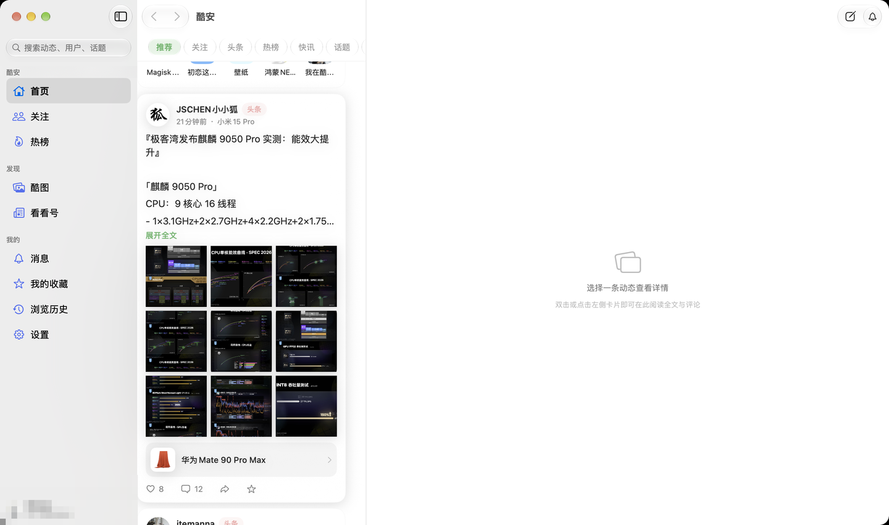
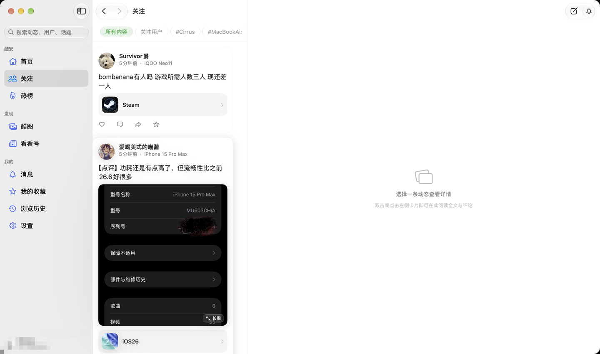
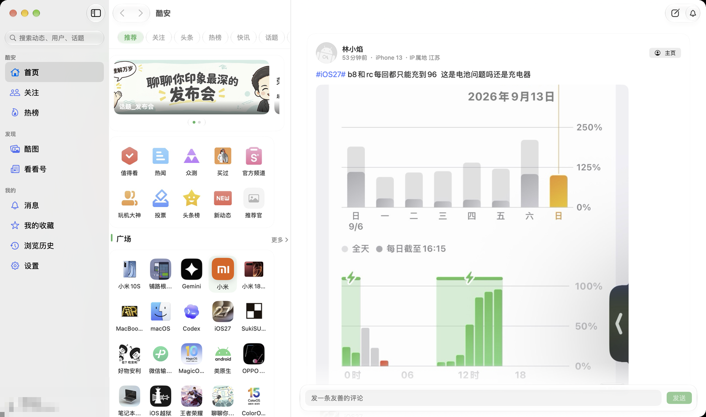
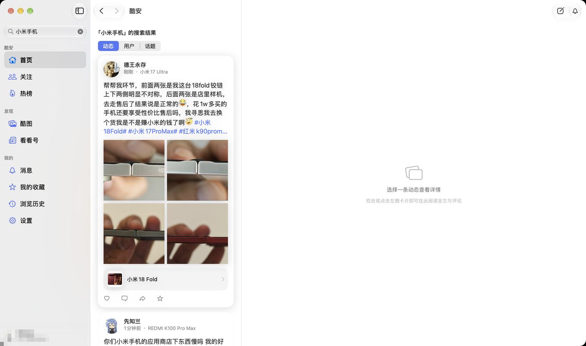

# Coolapk for Mac

原生 macOS 酷安第三方客户端，SwiftUI + Liquid Glass 编写，采用官方 App 的接口与数据结构。

## 截图

| 首页（推荐 / 头条 / 热榜） | 关注页 |
| :--: | :--: |
|  |  |

| 动态详情 | 搜索 |
| :--: | :--: |
|  |  |

截图里侧栏左下角的账号信息做了打码处理。

## 下载

预编译版本在 [Releases](https://github.com/Mora-han/coolapk-for-mac/releases)：当前 0.18.1
（macOS 26.0+，arm64 + x86_64 通用二进制）。包是本机 ad-hoc 签名、没有 Apple 公证，首次打开
需要右键 →「打开」，或先执行 `xattr -dr com.apple.quarantine /Applications/Coolapk.app`。

## 运行

```bash
# 生成 Xcode 工程（修改 project.yml 或增删源码后执行）
xcodegen generate

# 构建
xcodebuild -project CoolapkForMac.xcodeproj -scheme CoolapkForMac -configuration Debug -destination 'platform=macOS' build

# 或者直接打开
open CoolapkForMac.xcodeproj
```

要求 macOS 26.0 以上（Liquid Glass API）。

## 目录结构

代码按职责拆成两个可独立复用的本地 Swift 包 + 一个 App 层：

```
Packages/
  CoolapkKit/          酷安接口工具包（不依赖任何 UI，可直接给别的项目用）
    CoolapkClient      签名请求、token 缓存、失败重试、multipart 上传
    CoolapkToken       X-App-Token v3 生成（Android UA + 内置密码查找表）
    TokenTableV3       v3 token 用的密码查找表（取自官方客户端，静态数据）
    Bcrypt / BlowfishTables   纯 Swift bcrypt 实现，无第三方依赖
    JSON               容错 JSON 包装
    API                全部接口封装
    Models             数据模型
    FeedHTML           酷安 HTML 转 NSAttributedString（表情、话题、链接）
    RichTextView       NSTextView 富文本视图
    EmojiStore         本地表情资源

  LiquidGlassUI/       Liquid Glass 设计系统（与业务无关，可复用）
    Theme              配色、尺寸、格式化工具
    Glass              玻璃面板、胶囊 Tab、玻璃按钮等组件
    RemoteImage        远程图片（内存 + 磁盘缓存、降采样）、自适应比例单图
    ImageViewer        图片查看器（缩放、拖拽、缩略图、存储、复制）
    ImageLoader        图片缓存实现
    CommonViews        计数、标签、空状态、加载、错误条
    SourceListSidebar  原生侧边栏列表（AppKit source list，系统选中态）

CoolapkForMac/         应用层
  App/           应用入口、三栏主界面（NavigationSplitView）、AppStore
  Features/      按功能划分的页面
    Home/          首页信息流与各类卡片
    Detail/        动态详情与评论
    Profile/       用户主页
    Discover/      应用、话题、商品
    Search/        搜索
    Notifications/ 通知、私信、历史、收藏
    Social/        收藏夹、看看号、问答、投票、点赞的人
    Compose/       发布动态
    Login/         登录
    Settings/      设置
  AppIcon.icon   Icon Composer 图标（actool 编进 Assets.car）
  Resources/Emoji/  官方表情包
```

两个包可以单独使用：

```swift
import CoolapkKit      // 只要接口能力
import LiquidGlassUI   // 只要界面组件
```

## 登录

未登录即可浏览首页、详情、话题、应用与搜索。关注、收藏、评论等功能需要登录：
侧栏左下角的账号入口 → 登录，弹出酷安网页登录，登录成功后自动抓取 Cookie 与 token。
登录后这个位置显示头像、昵称与酷安 ID，点按进入「我」。

## 搜索

搜索框固定在侧栏左上角（与 App Store 一致）：点一下切到搜索页，输入后停顿约 0.35 秒自动出结果，
候选词、搜索历史与酷安热搜都在内容列里。结果分「动态 / 用户 / 话题」三类，用户与话题可以直接点进去；
「加载更多」翻页追加。搜索页会记进前进 / 后退，点侧栏任意入口即可离开。

## 关注

首页「关注」标签与侧栏「关注」是同一个页面，顶部一条玻璃胶囊切换内容来源：

- **所有内容**：关注的人（`type=circle`）与关注的话题（`type=tag`）两条流各取同一页，按发布时间
  合并成一条时间线，同一条动态只留一份。
- **关注用户**：只看关注的人。
- **#话题**：关注的话题逐个列在胶囊里（按页取到 5 页为止），点了切到该话题的最新动态。
- **更多话题**：跳到完整列表 `/UserHelper/getFollowRows?uid=…&type=topic`，点卡片进话题。

关注页的列表状态挂在 `AppStore` 上，首页与侧栏两个入口共用，来回切换不会重新拉取；退出登录时清空。
未登录时页面提示先登录。

## 调试

设置环境变量可直接打开指定页面，便于截图和自动化：

```bash
COOLAPK_OPEN="dyh:1480"                     # 看看号
COOLAPK_OPEN="page:V9_HOME_TAB_RANKING"     # 指定某个数据源页面
COOLAPK_OPEN="search:小米"                   # 打开搜索并直接出结果
COOLAPK_OPEN_FEED=73714177                  # 直接打开一条动态详情
COOLAPK_TAB=V9_HOME_TAB_HEADLINE            # 首页切到指定标签
COOLAPK_NOTIFY=likes                        # 消息页切到指定分类
COOLAPK_FOLLOW=users                        # 关注页切到某个来源（all/users/more/topic:iOS27）
COOLAPK_SCROLL=3                            # 列表加载后滚动到第 N 行
COOLAPK_DEBUG=1                             # 打印请求日志
```

支持的前缀：feed、user、topic、product、app、collection、dyh、question、vote、page、path、nav、search。

`COOLAPK_DEBUG=1` 时请求日志走 `CoolapkKit` 的 `CoolapkLog.sink`。应用开了沙盒，
容器外路径（例如 `/tmp`）写不进去，日志会回落到：

```
~/Library/Containers/com.mora.coolapkformac/Data/tmp/coolapk-debug.log
```

也可以指定容器内路径：

```bash
COOLAPK_LOG_FILE="$HOME/Library/Containers/com.mora.coolapkformac/Data/tmp/mine.log"
```

> 首页「推荐」标签走 `/v6/main/indexV8`（含横幅与卡片），「头条」标签走 `/v6/main/headline`，
> 两套内容不同，与官方客户端一致。

## 版本

见 [CHANGELOG.md](CHANGELOG.md)。每个功能一个 0.x.x 版本，对应一个 git tag，可随时回退。
